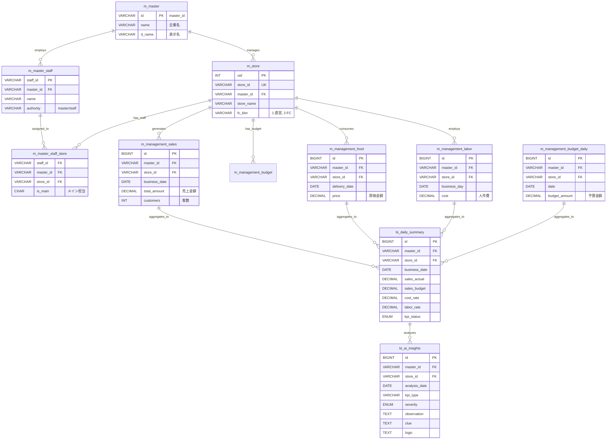
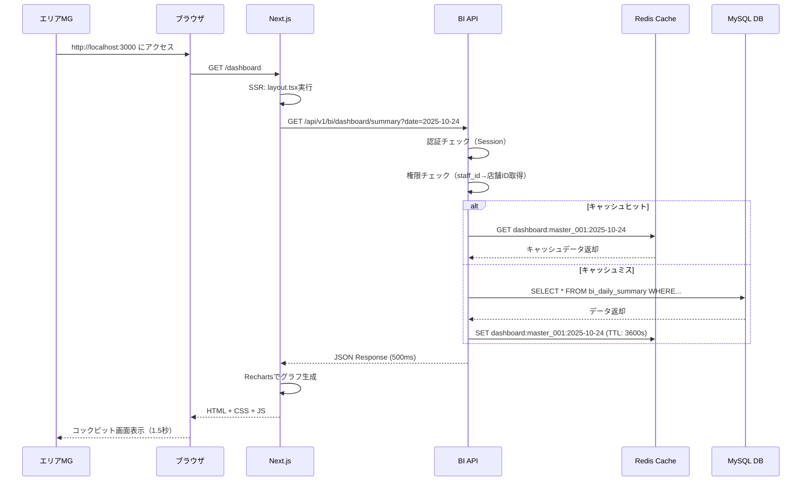
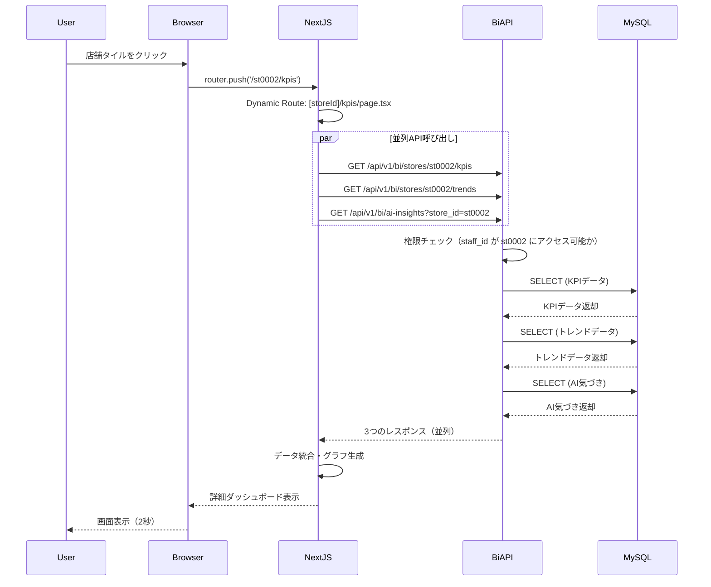
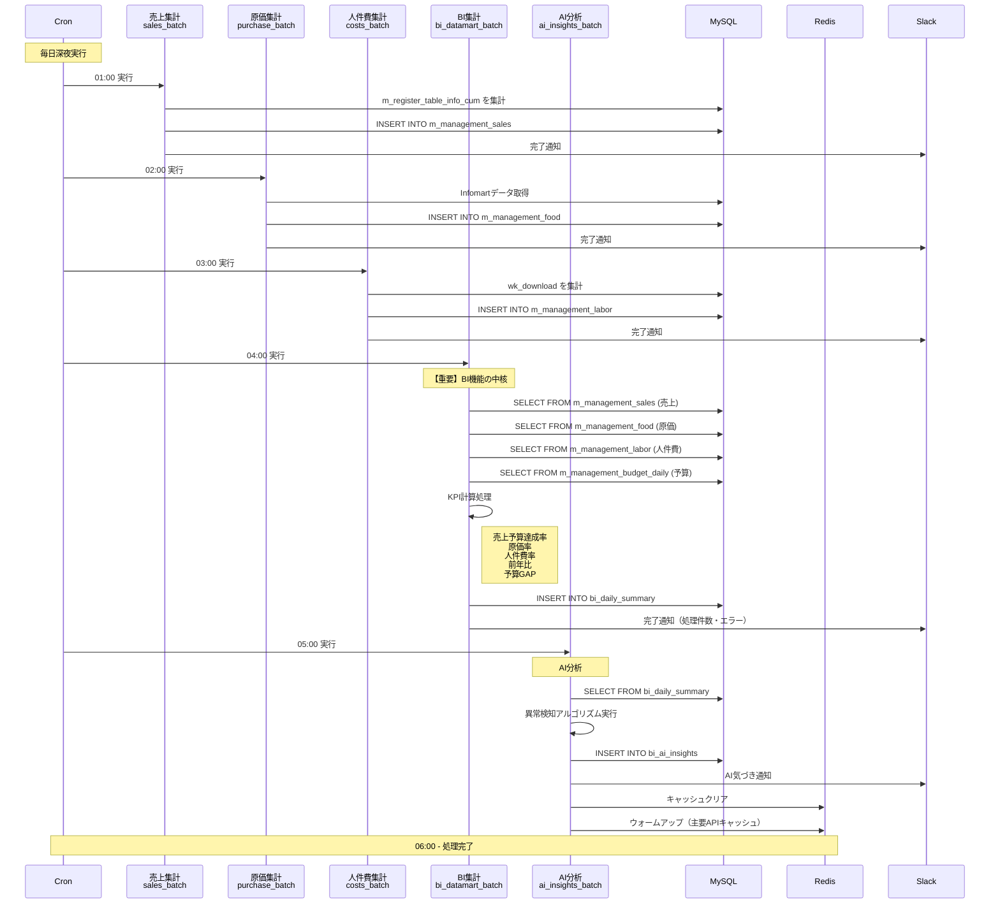
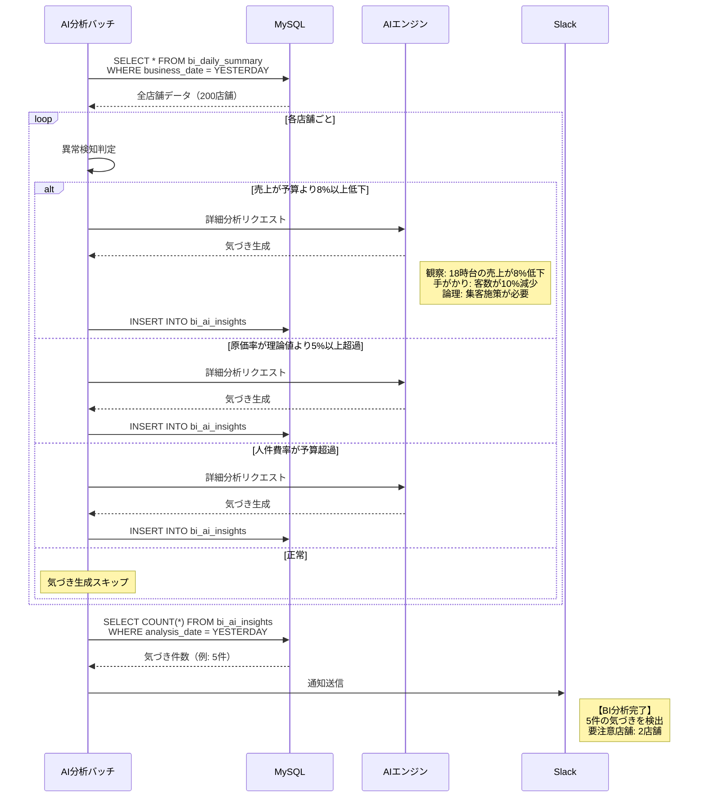

# 📐 チビックシステム - BI機能 ER図・シーケンス図

**バージョン:** 3.0.0  
**作成日:** 2025年10月25日

---

## 📊 ER図（Entity Relationship Diagram）

### 主要テーブルのリレーションシップ



---

## 🔄 シーケンス図

### 1. コックピット画面表示のシーケンス



---

### 2. 店舗詳細ダッシュボード表示のシーケンス



---

### 3. バッチ処理のシーケンス



---

### 4. AI気づき生成のシーケンス



---

## 🗄️ データベース詳細設計

### テーブル定義（完全版）

#### 1. bi_daily_summary（日次サマリー）- 409 bytes/row

```sql
CREATE TABLE bi_daily_summary (
    -- 主キー
    id BIGINT UNSIGNED AUTO_INCREMENT PRIMARY KEY,
    
    -- 識別子
    master_id VARCHAR(8) NOT NULL COMMENT 'マスターID',
    store_id VARCHAR(6) NOT NULL COMMENT '店舗ID',
    business_date DATE NOT NULL COMMENT '営業日',
    
    -- 売上KPI
    sales_actual DECIMAL(12,2) DEFAULT 0.00 COMMENT '売上実績',
    sales_budget DECIMAL(12,2) DEFAULT 0.00 COMMENT '売上予算',
    sales_last_year DECIMAL(12,2) DEFAULT 0.00 COMMENT '昨年売上',
    sales_gap DECIMAL(12,2) DEFAULT 0.00 COMMENT '予算GAP',
    sales_gap_percentage DECIMAL(5,2) DEFAULT 0.00 COMMENT '予算GAP率(%)',
    sales_change_rate DECIMAL(5,2) DEFAULT 0.00 COMMENT '前年比(%)',
    sales_forecast DECIMAL(12,2) DEFAULT 0.00 COMMENT '月末着地見込み',
    
    -- 客数・客単価KPI
    customers INT DEFAULT 0 COMMENT '客数',
    unit_price DECIMAL(10,2) DEFAULT 0.00 COMMENT '客単価',
    customers_last_year INT DEFAULT 0 COMMENT '昨年客数',
    
    -- 原価KPI
    cost_actual DECIMAL(12,2) DEFAULT 0.00 COMMENT '原価実績',
    cost_rate DECIMAL(5,2) DEFAULT 0.00 COMMENT '原価率(%)',
    cost_budget_rate DECIMAL(5,2) DEFAULT 0.00 COMMENT '予算原価率(%)',
    cost_theory_rate DECIMAL(5,2) NULL COMMENT '理論原価率(%)',
    cost_gap_amount DECIMAL(12,2) DEFAULT 0.00 COMMENT '原価GAP金額',
    cost_gap_rate DECIMAL(5,2) DEFAULT 0.00 COMMENT '原価率GAP(%)',
    cost_over_percentage DECIMAL(5,2) DEFAULT 0.00 COMMENT '理論値超過率(%)',
    cost_monthly_impact DECIMAL(12,2) DEFAULT 0.00 COMMENT '月間影響額',
    
    -- 人件費KPI
    labor_actual DECIMAL(12,2) DEFAULT 0.00 COMMENT '人件費実績',
    labor_rate DECIMAL(5,2) DEFAULT 0.00 COMMENT '人件費率(%)',
    labor_budget_rate DECIMAL(5,2) DEFAULT 0.00 COMMENT '予算人件費率(%)',
    labor_theory_rate DECIMAL(5,2) NULL COMMENT '理論人件費率(%)',
    labor_gap_amount DECIMAL(12,2) DEFAULT 0.00 COMMENT '人件費GAP金額',
    labor_gap_rate DECIMAL(5,2) DEFAULT 0.00 COMMENT '人件費率GAP(%)',
    labor_over_percentage DECIMAL(5,2) DEFAULT 0.00 COMMENT '理論値超過率(%)',
    labor_monthly_impact DECIMAL(12,2) DEFAULT 0.00 COMMENT '月間影響額',
    
    -- 複合KPI
    fl_cost_rate DECIMAL(5,2) DEFAULT 0.00 COMMENT 'FL比率(%)  = 原価率 + 人件費率',
    operating_profit_rate DECIMAL(5,2) DEFAULT 0.00 COMMENT '営業利益率(%)',
    
    -- ステータス判定
    sales_status ENUM('success', 'warning', 'danger') DEFAULT 'success',
    cost_status ENUM('success', 'warning', 'danger') DEFAULT 'success',
    labor_status ENUM('success', 'warning', 'danger') DEFAULT 'success',
    overall_status ENUM('success', 'warning', 'danger') DEFAULT 'success',
    
    -- メタデータ
    is_calculated TINYINT DEFAULT 0 COMMENT '計算済みフラグ',
    calculated_at TIMESTAMP NULL COMMENT '計算日時',
    created_at TIMESTAMP DEFAULT CURRENT_TIMESTAMP,
    updated_at TIMESTAMP DEFAULT CURRENT_TIMESTAMP ON UPDATE CURRENT_TIMESTAMP,
    
    -- 制約・インデックス
    UNIQUE KEY uk_store_date (master_id, store_id, business_date),
    INDEX idx_date (business_date),
    INDEX idx_store_date (store_id, business_date DESC),
    INDEX idx_status (overall_status, business_date),
    INDEX idx_calculated (is_calculated, business_date),
    INDEX idx_master_date (master_id, business_date DESC)
) ENGINE=InnoDB DEFAULT CHARSET=utf8mb4 
COMMENT='BI日次サマリーテーブル - 全KPIを事前集計済み';
```

**容量試算:**
- 1店舗×365日 = 365行 × 409 bytes = 約149KB
- 200店舗×3年 = 219,000行 × 409 bytes = 約90MB
- **結論:** MySQLで十分対応可能

---

#### 2. bi_monthly_summary（月次サマリー）

```sql
CREATE TABLE bi_monthly_summary (
    id BIGINT UNSIGNED AUTO_INCREMENT PRIMARY KEY,
    master_id VARCHAR(8) NOT NULL,
    store_id VARCHAR(6) NOT NULL,
    yearmonth VARCHAR(6) NOT NULL COMMENT 'YYYYMM',
    
    -- 月間実績
    monthly_sales_actual DECIMAL(12,2) DEFAULT 0,
    monthly_sales_budget DECIMAL(12,2) DEFAULT 0,
    monthly_sales_last_year DECIMAL(12,2) DEFAULT 0,
    
    cumulative_sales_actual DECIMAL(12,2) DEFAULT 0 COMMENT '累計実績（年初から）',
    cumulative_sales_budget DECIMAL(12,2) DEFAULT 0 COMMENT '累計予算',
    
    monthly_cost_rate DECIMAL(5,2) DEFAULT 0,
    monthly_labor_rate DECIMAL(5,2) DEFAULT 0,
    monthly_fl_rate DECIMAL(5,2) DEFAULT 0,
    
    -- 決済手数料・マーケットプレイス手数料
    payment_fees DECIMAL(12,2) DEFAULT 0 COMMENT '決済手数料合計',
    marketplace_fees DECIMAL(12,2) DEFAULT 0 COMMENT 'プラットフォーム手数料合計',
    
    created_at TIMESTAMP DEFAULT CURRENT_TIMESTAMP,
    updated_at TIMESTAMP DEFAULT CURRENT_TIMESTAMP ON UPDATE CURRENT_TIMESTAMP,
    
    UNIQUE KEY uk_store_month (master_id, store_id, yearmonth),
    INDEX idx_yearmonth (yearmonth DESC)
) ENGINE=InnoDB DEFAULT CHARSET=utf8mb4
COMMENT='BI月次サマリーテーブル';
```

---

#### 3. bi_ai_insights（AI分析結果）

```sql
CREATE TABLE bi_ai_insights (
    id BIGINT UNSIGNED AUTO_INCREMENT PRIMARY KEY,
    
    -- 識別子
    master_id VARCHAR(8) NOT NULL,
    store_id VARCHAR(6) NOT NULL,
    analysis_date DATE NOT NULL COMMENT '分析対象日',
    
    -- KPI種別
    kpi_type VARCHAR(50) NOT NULL COMMENT 'sales/cost_rate/labor_cost_rate/menu/staff',
    severity ENUM('high', 'medium', 'low') DEFAULT 'medium' COMMENT '重要度',
    
    -- 気づき内容
    emoji VARCHAR(10) DEFAULT '💡' COMMENT '絵文字',
    message TEXT NOT NULL COMMENT '気づきメッセージ',
    
    -- 3ステップ分析
    observation TEXT NOT NULL COMMENT '📊 観察: 何が起きているか',
    clue TEXT NOT NULL COMMENT '🔍 手がかり: なぜ起きているか',
    logic TEXT NOT NULL COMMENT '💡 結論: どうすべきか',
    
    -- 推奨アクション（JSON配列）
    recommended_actions JSON COMMENT '[{id, label, icon, action_type, target}]',
    
    -- ステータス管理
    is_dismissed TINYINT DEFAULT 0 COMMENT '0: 未確認, 1: 確認済み',
    dismissed_at TIMESTAMP NULL,
    dismissed_by VARCHAR(10) NULL COMMENT 'staff_id',
    
    -- メタデータ
    created_at TIMESTAMP DEFAULT CURRENT_TIMESTAMP,
    
    -- インデックス
    INDEX idx_store_date (store_id, analysis_date DESC),
    INDEX idx_severity (severity, is_dismissed),
    INDEX idx_kpi_type (kpi_type, analysis_date DESC),
    INDEX idx_dismissed (is_dismissed, analysis_date DESC)
) ENGINE=InnoDB DEFAULT CHARSET=utf8mb4
COMMENT='AI分析結果テーブル - 異常検知とレコメンデーション';
```

**JSON構造例:**
```json
{
  "recommended_actions": [
    {
      "id": "action_001",
      "label": "予約データを確認する",
      "icon": "📅",
      "action_type": "navigate",
      "target": "/st0002/reservations"
    },
    {
      "id": "action_002",
      "label": "この気づきを確認済みにする",
      "icon": "✅",
      "action_type": "dismiss",
      "target": null
    }
  ]
}
```

---

## 🔌 API設計詳細

### OpenAPI 3.0 定義（抜粋）

**bi-api/openapi/api/bi.yaml**

```yaml
openapi: 3.0.3
info:
  title: チビックシステム - BI API
  version: 1.0.0
  description: 経営コックピット用BI機能API

tags:
  - name: Dashboard
    description: ダッシュボード関連
  - name: KPI
    description: KPI分析関連
  - name: AI
    description: AI分析関連

paths:
  /api/v1/bi/dashboard/summary:
    get:
      tags: [Dashboard]
      summary: 全店舗サマリー取得
      parameters:
        - name: date
          in: query
          required: true
          schema:
            type: string
            format: date
            example: "2025-10-24"
      responses:
        '200':
          description: 成功
          content:
            application/json:
              schema:
                type: object
                properties:
                  stores:
                    type: array
                    items:
                      $ref: '#/components/schemas/StoreSummary'
                  ai_insights:
                    type: array
                    items:
                      $ref: '#/components/schemas/AIInsight'
        '401':
          $ref: '#/components/responses/Unauthorized'
        '403':
          $ref: '#/components/responses/Forbidden'

  /api/v1/bi/stores/{storeId}/kpis:
    get:
      tags: [KPI]
      summary: 店舗別KPI取得
      parameters:
        - name: storeId
          in: path
          required: true
          schema:
            type: string
            example: "st0002"
        - name: start_date
          in: query
          required: true
          schema:
            type: string
            format: date
        - name: end_date
          in: query
          required: true
          schema:
            type: string
            format: date
      responses:
        '200':
          description: 成功
          content:
            application/json:
              schema:
                $ref: '#/components/schemas/StoreKPIResponse'

components:
  schemas:
    StoreSummary:
      type: object
      properties:
        store_id:
          type: string
          example: "st0002"
        store_name:
          type: string
          example: "ちびっく酒場 新橋店"
        kpis:
          type: object
          properties:
            sales:
              $ref: '#/components/schemas/KPI'
            cost_rate:
              $ref: '#/components/schemas/KPI'
            labor_cost_rate:
              $ref: '#/components/schemas/KPI'
        sparkline:
          type: array
          items:
            type: number
          example: [520000, 550000, 450000, 600000, 620000, 580000, 480000]
    
    KPI:
      type: object
      properties:
        actual:
          type: number
          example: 480000
        budget:
          type: number
          example: 500000
        last_year:
          type: number
          example: 520000
        change_rate:
          type: number
          format: float
          example: -7.69
        status:
          type: string
          enum: [success, warning, danger]
          example: "danger"
    
    AIInsight:
      type: object
      properties:
        id:
          type: string
        store_id:
          type: string
        kpi_type:
          type: string
        severity:
          type: string
          enum: [high, medium, low]
        emoji:
          type: string
        message:
          type: string
        observation:
          type: string
        clue:
          type: string
        logic:
          type: string
        recommended_actions:
          type: array
          items:
            $ref: '#/components/schemas/RecommendedAction'
```

---

## 🚀 バッチ処理実装詳細

### update_bi_datamart.php（完全実装例）

```php
<?php
/**
 * BIデータマート更新バッチ
 * 
 * 実行タイミング: 毎日深夜4:00
 * 処理時間: 約10-15分（200店舗の場合）
 */

require_once(__DIR__ . '/../vendor/autoload.php');

use App\Services\DataMartService;
use Illuminate\Support\Facades\DB;
use Illuminate\Support\Facades\Log;

// Laravel起動
$app = require_once __DIR__.'/../bootstrap/app.php';
$kernel = $app->make(Illuminate\Contracts\Console\Kernel::class);
$kernel->bootstrap();

try {
    $startTime = microtime(true);
    Log::info('[BI] データマート更新バッチ開始');
    
    // 対象日（昨日）
    $targetDate = date('Y-m-d', strtotime('-1 day'));
    
    // 全店舗取得
    $stores = DB::connection('mysql')
        ->table('m_store')
        ->where('add_delete', '')
        ->get();
    
    $successCount = 0;
    $errorCount = 0;
    
    foreach ($stores as $store) {
        try {
            // データマートサービスでKPI計算
            $service = new DataMartService();
            $summary = $service->calculateDailySummary(
                $store->master_id,
                $store->store_id,
                $targetDate
            );
            
            // bi_daily_summary に保存
            DB::table('bi_daily_summary')->updateOrInsert(
                [
                    'master_id' => $store->master_id,
                    'store_id' => $store->store_id,
                    'business_date' => $targetDate,
                ],
                array_merge($summary, [
                    'is_calculated' => 1,
                    'calculated_at' => now(),
                ])
            );
            
            $successCount++;
            
        } catch (Exception $e) {
            Log::error("[BI] 店舗 {$store->store_id} の処理失敗: " . $e->getMessage());
            $errorCount++;
        }
    }
    
    $endTime = microtime(true);
    $duration = round($endTime - $startTime, 2);
    
    Log::info("[BI] データマート更新完了: 成功={$successCount}, エラー={$errorCount}, 時間={$duration}秒");
    
    // Slack通知
    notifySlack("✅ BIデータマート更新完了\n成功: {$successCount}店舗\nエラー: {$errorCount}店舗\n処理時間: {$duration}秒");
    
} catch (Exception $e) {
    Log::error('[BI] バッチ処理エラー: ' . $e->getMessage());
    notifySlack("❌ BIデータマート更新失敗\n" . $e->getMessage());
    exit(1);
}

function notifySlack($message) {
    // Slack Webhook実装
}
```

---

## 📚 次のステップ

調査完了により、以下が明確になりました：

### ✅ 明確になったこと

1. **データは既に存在** - 新規データ収集不要
2. **技術スタックは統一** - Laravel + Next.js
3. **バッチ処理の仕組みあり** - 日次更新で十分
4. **権限管理は実装済み** - 既存の仕組みを活用

### ⚠️ 追加調査が必要なこと

1. **理論原価の計算方法** - `m_recipe`テーブルの存在確認
2. **メニュー別売上の取得** - `m_register_sales_menu`の確認
3. **時間帯別売上の取得** - `m_register_table_info`の時間カラム確認

### 🚀 実装準備完了

以下のドキュメントが完成：
- ✅ `DESIGN_INVESTIGATION_SUMMARY.md` - 調査サマリー
- ✅ `DESIGN_SPECIFICATION.md` - 完全設計書
- ✅ `DESIGN_TECHNICAL_DETAILS.md` - 技術詳細
- ✅ `DESIGN_ER_AND_SEQUENCE.md` - ER図・シーケンス図

**次のアクション:**
- 経営陣・開発チームへのレビュー依頼
- 追加調査項目の確認
- 実装着手の承認取得

---

**製作者:** Claude (Cursor AI)  
**調査時間:** 約90分  
**信頼度:** ★★★★☆ (85% - 一部追加調査必要)


