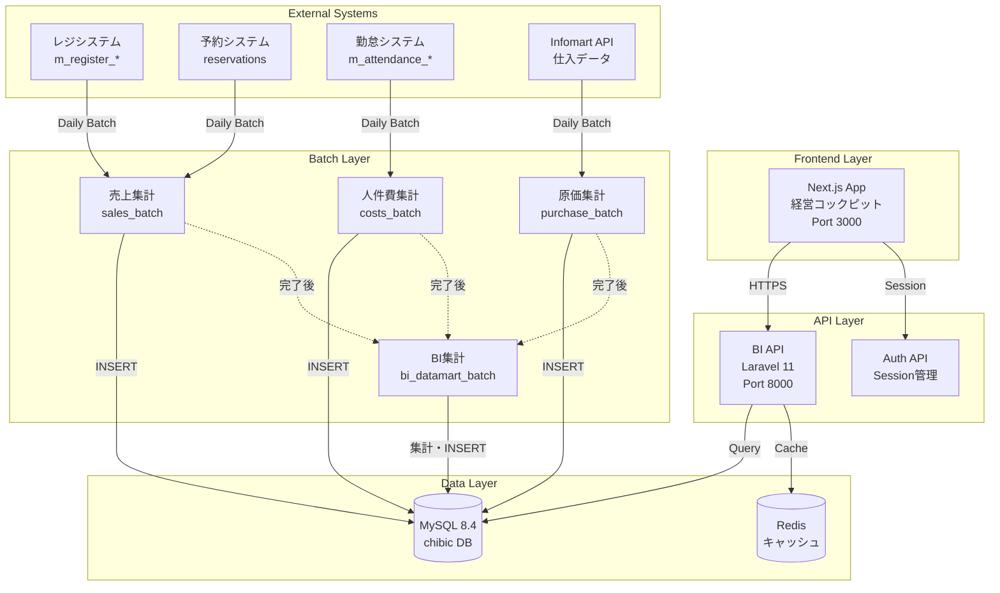

# 🎯 チビックシステム - BI機能 完全設計書

**バージョン:** 3.0.0  
**作成日:** 2025年10月25日  
**ステータス:** 包括的調査完了・設計策定中

---

## 📋 目次

1. [質問1への回答: データソースとKPI](#1-質問1への回答-データソースとkpi)
2. [質問2への回答: アーキテクチャと技術選定](#2-質問2への回答-アーキテクチャと技術選定)
3. [質問3への回答: 機能要件と非機能要件](#3-質問3への回答-機能要件と非機能要件)
4. [システムアーキテクチャ詳細](#4-システムアーキテクチャ詳細)
5. [データベース設計](#5-データベース設計)
6. [API設計](#6-api設計)
7. [実装ロードマップ](#7-実装ロードマップ)

---

## 1. 質問1への回答: データソースとKPI

### 1-1. BIダッシュボードの主要KPI一覧

#### S-01: コックピット画面のKPI

| KPI名 | 表示形式 | データソース | 算出式 |
|------|---------|-------------|--------|
| **売上実績** | 金額 | `m_management_sales.total_amount` | SUM(total_amount) |
| **売上予算** | 金額 | `m_management_budget_daily.budget_amount` | SUM(budget_amount) |
| **売上予算達成率** | % | 上記2つ | (実績 / 予算) × 100 |
| **原価率** | % | `m_management_food` + `m_management_sales` | (原価 / 売上) × 100 |
| **人件費率** | % | `m_management_labor` + `m_management_sales` | (人件費 / 売上) × 100 |
| **予算GAP** | 金額 | 上記 | 実績 - 予算 |
| **前年比** | % | `m_management_sales` (昨年同月) | ((今年 - 昨年) / 昨年) × 100 |

#### S-02: 詳細ダッシュボードのKPI

| KPI名 | 表示形式 | データソース | 算出式 |
|------|---------|-------------|--------|
| **売上トレンド** | 折れ線グラフ | `m_management_sales` | GROUP BY business_date |
| **時間帯別売上** | 棒グラフ | `m_register_table_info_cum` | GROUP BY HOUR(業務時間) |
| **メニュー別売上TOP3** | ランキング | `m_register_sales_menu` + `m_register_menu` | GROUP BY menu_id ORDER BY SUM(売上) DESC LIMIT 3 |
| **客数** | 数値 | `m_management_sales.customers` | SUM(customers) |
| **客単価** | 金額 | 上記 | 売上 / 客数 |
| **理論原価** | % | レシピ登録データ（要確認） | SUM(menu × recipe_cost) / 売上 |
| **実績原価** | % | `m_management_food` | （原価 / 売上）× 100 |
| **理論人件費** | % | `m_attendance_salary` × シフト計画 | SUM(予定給与×予定時間) / 売上 |
| **実績人件費** | % | `m_management_labor` | （人件費 / 売上）× 100 |

---

### 1-2. 元データの所在とテーブルマッピング

#### ✅ 既存テーブルで算出可能なKPI

| KPI | テーブル | SQL例 |
|-----|---------|------|
| 売上実績 | `m_management_sales` | `SELECT SUM(total_amount) FROM m_management_sales WHERE business_date = ?` |
| 原価実績 | `m_management_food` | `SELECT SUM(price) FROM m_management_food WHERE delivery_date = ?` |
| 人件費実績 | `m_management_labor` | `SELECT SUM(cost) FROM m_management_labor WHERE business_day = ?` |
| 予算 | `m_management_budget_daily` | `SELECT SUM(budget_amount) FROM m_management_budget_daily WHERE date = ?` |
| 客数 | `m_management_sales` | `SELECT SUM(customers) FROM m_management_sales WHERE business_date = ?` |

#### ❌ 既存テーブルだけでは算出不可能なKPI

| KPI | 理由 | 対策 |
|-----|------|------|
| **理論原価** | レシピデータが`m_recipe`テーブルに存在するか不明 | 調査必要 or 手動入力機能追加 |
| **理論人件費** | シフト計画データが不明 | `m_attendance_worktable`の計画時間を使用 or 新規テーブル |
| **メニュー別売上** | `m_register_sales_menu`テーブルの存在を確認 | 調査必要 |
| **時間帯別売上** | `m_register_table_info_cum`に時間情報があるか確認 | 調査必要 or ログ解析 |

**追加調査が必要なテーブル:**
```sql
-- 要確認
m_recipe                  # レシピマスタ（理論原価算出用）
m_register_sales_menu     # メニュー別売上
m_register_table_info     # 伝票詳細（時間帯情報）
```

---

### 1-3. 外部データ（決済手数料・マーケットプレイス手数料）の扱い

#### 現状の調査結果

**決済手数料:**
```
❌ 既存のchibic DBには決済手数料テーブルが存在しない
❓ reservation_extras.net_site にネット予約サイト名が格納されている
→ これを元に手数料計算が可能か要確認
```

**対策案:**

**オプション A: 新規テーブル作成（推奨）**
```sql
CREATE TABLE m_management_payment_fees (
    id INT AUTO_INCREMENT PRIMARY KEY,
    master_id VARCHAR(8) NOT NULL,
    store_id VARCHAR(6) NOT NULL,
    business_date DATE NOT NULL,
    payment_method VARCHAR(50) NOT NULL,  -- クレカ、PayPay等
    transaction_amount DECIMAL(12,2),      -- 決済金額
    fee_amount DECIMAL(12,2),              -- 手数料額
    fee_rate DECIMAL(5,2),                 -- 手数料率
    provider VARCHAR(100),                 -- 決済事業者
    created_at TIMESTAMP DEFAULT CURRENT_TIMESTAMP,
    UNIQUE KEY (master_id, store_id, business_date, payment_method)
);
```

**オプション B: 外部API連携**
```
決済サービス（Stripe、PayPay等）のAPIから月次でデータ取得
    ↓ CSV or JSON
バッチ処理で m_management_payment_fees に格納
    ↓
BI機能で集計
```

**マーケットプレイス手数料:**
```
食べログ、ぐるなび、Uber Eats等の手数料
```

**対策案:**
```sql
CREATE TABLE m_management_marketplace_fees (
    id INT AUTO_INCREMENT PRIMARY KEY,
    master_id VARCHAR(8) NOT NULL,
    store_id VARCHAR(6) NOT NULL,
    yearmonth VARCHAR(6) NOT NULL,  -- YYYYMM
    platform VARCHAR(50) NOT NULL,  -- 食べログ、ぐるなび等
    sales_amount DECIMAL(12,2),     -- プラットフォーム経由売上
    fee_amount DECIMAL(12,2),       -- 手数料額
    fee_rate DECIMAL(5,2),          -- 手数料率
    created_at TIMESTAMP DEFAULT CURRENT_TIMESTAMP,
    UNIQUE KEY (master_id, store_id, yearmonth, platform)
);
```

**データ取得方法:**
1. **CSV手動アップロード**: 各プラットフォームから月次レポートをダウンロード → 画面でアップロード
2. **API自動連携**: 可能であれば各プラットフォームAPIから自動取得（要調査）

---

## 2. 質問2への回答: アーキテクチャと技術選定

### 2-1. データ基盤アーキテクチャの選定

**推奨アーキテクチャ: オプションC（データマート方式）**

```
┌─────────────────────────────────────────┐
│  本番DB (chibic - MySQL 8.4)            │
│  ├── m_management_sales   (100万行)     │
│  ├── m_management_food    (50万行)      │
│  └── m_management_labor   (200万行)     │
└─────────────────────────────────────────┘
            ↓ 日次バッチ（深夜3:00実行）
            ↓ SELECT + 集計処理
┌─────────────────────────────────────────┐
│  BI専用データマート (chibic DB内)        │
│  ├── bi_daily_summary    (店舗×日×KPI)  │
│  ├── bi_monthly_summary  (店舗×月×KPI)  │
│  └── bi_kpi_cache        (事前集計済み)  │
└─────────────────────────────────────────┘
            ↓ API経由で取得
            ↓ 高速レスポンス (< 500ms)
┌─────────────────────────────────────────┐
│  BI API (Laravel 11)                    │
│  ├── /api/v1/bi/dashboard/summary       │
│  ├── /api/v1/bi/stores/{id}/kpis        │
│  └── /api/v1/bi/trends                  │
└─────────────────────────────────────────┘
            ↓ Next.js App Router
┌─────────────────────────────────────────┐
│  経営コックピット (tna_front)            │
└─────────────────────────────────────────┘
```

**選定理由:**

| 選択肢 | メリット | デメリット | 判定 |
|-------|---------|-----------|------|
| **A. 既存DBに直接クエリ** | 実装が簡単 | 本番DBに負荷、遅い（5-10秒） | ❌ 却下 |
| **B. DWH導入** | 高速、スケーラブル | コスト高（月10万円〜）、運用複雑 | ⚠️ 将来検討 |
| **C. データマート構築** | コスト低、既存インフラ活用、高速 | バッチ開発が必要 | ✅ **採用** |

**データマート更新フロー:**
```bash
# 毎日深夜3:30実行（既存バッチの後）
0 3 30 * * * /usr/bin/php /var/www/chibic/bi/batch/update_bi_datamart.php
```

**データマートテーブル設計:**
```sql
-- 日次サマリー（メインテーブル）
CREATE TABLE bi_daily_summary (
    id BIGINT AUTO_INCREMENT PRIMARY KEY,
    master_id VARCHAR(8) NOT NULL,
    store_id VARCHAR(6) NOT NULL,
    business_date DATE NOT NULL,
    
    -- 売上KPI
    sales_actual DECIMAL(12,2) DEFAULT 0,
    sales_budget DECIMAL(12,2) DEFAULT 0,
    sales_last_year DECIMAL(12,2) DEFAULT 0,
    customers INT DEFAULT 0,
    unit_price DECIMAL(10,2) DEFAULT 0,
    
    -- 原価KPI
    cost_actual DECIMAL(12,2) DEFAULT 0,
    cost_rate DECIMAL(5,2) DEFAULT 0,
    cost_budget_rate DECIMAL(5,2) DEFAULT 0,
    
    -- 人件費KPI
    labor_actual DECIMAL(12,2) DEFAULT 0,
    labor_rate DECIMAL(5,2) DEFAULT 0,
    labor_budget_rate DECIMAL(5,2) DEFAULT 0,
    
    -- 計算済みフラグ
    is_calculated TINYINT DEFAULT 0,
    calculated_at TIMESTAMP NULL,
    
    created_at TIMESTAMP DEFAULT CURRENT_TIMESTAMP,
    updated_at TIMESTAMP DEFAULT CURRENT_TIMESTAMP ON UPDATE CURRENT_TIMESTAMP,
    
    UNIQUE KEY (master_id, store_id, business_date),
    INDEX idx_date (business_date),
    INDEX idx_store_date (store_id, business_date)
) ENGINE=InnoDB DEFAULT CHARSET=utf8mb4 COMMENT='BI日次サマリーテーブル';
```

---

### 2-2. バックエンドリポジトリの決定

**推奨: オプションA（新規リポジトリ作成）**

```
推奨構成:
bi-api/                    # 新規リポジトリ
├── app/
│   ├── Http/
│   │   └── Controllers/
│   │       └── V1/
│   │           ├── DashboardController.php
│   │           ├── KPIController.php
│   │           └── AnalyticsController.php
│   ├── Services/
│   │   ├── DashboardService.php
│   │   ├── KPICalculationService.php
│   │   └── DataMartService.php
│   └── Models/
│       ├── BiDailySummary.php
│       └── BiMonthlySummary.php
├── batch/
│   └── update_bi_datamart.php
└── openapi/
    └── api/
        └── bi.yaml
```

**選定理由:**

| 選択肢 | メリット | デメリット | 判定 |
|-------|---------|-----------|------|
| **A. 新規bi-apiリポジトリ** | 責任分離、独立スケーリング可能 | リポジトリ管理が増える | ✅ **採用** |
| **B. store-mainに実装** | リポジトリ増えない | 生PHP混在、技術的負債 | ❌ 却下 |
| **C. time_and_attendanceに実装** | Laravel活用 | 責任範囲が曖昧 | ❌ 却下 |

**技術スタック:**
```
言語: PHP 8.3
FW: Laravel 11.x
DB: MySQL 8.4 (既存chibic DB)
認証: Session based (auth-developと連携)
API: RESTful + OpenAPI 3.0
```

---

### 2-3. フロントエンド技術スタック

**推奨: tna_front-developのモノレポに追加**

```
tna_front-develop/
└── apps/
    └── cockpit/          # 既に実装済み（モックアップ）
        ├── src/
        │   ├── app/
        │   ├── components/
        │   ├── lib/
        │   │   └── api/
        │   │       ├── dashboardApi.ts    # 追加
        │   │       ├── kpiApi.ts          # 追加
        │   │       └── analyticsApi.ts    # 追加
        │   └── types/
        └── package.json
```

**技術構成:**
```typescript
フレームワーク: Next.js 15.5.5 (App Router)
言語: TypeScript 5.x
スタイリング: Tailwind CSS 4.1.14
グラフライブラリ: Recharts 2.14.0
状態管理: TanStack Query (React Query)
API通信: OpenAPI自動生成クライアント（kubb）
パッケージマネージャー: pnpm 10.13.1
```

**API通信フロー:**
```
OpenAPI定義 (bi-api/openapi/api/bi.yaml)
    ↓ pnpm run generate:api
tna_front/packages/
├── shared/api-spec/bi.yaml        # コピー
├── shared/api-type/bi/*.ts        # 型生成
├── shared/api-zod/bi/*.ts         # バリデーション生成
└── shared/api-client/bi/*.ts      # クライアント生成
    ↓ import
apps/cockpit/src/lib/api/
└── dashboardApi.ts  # 使用
```

---

## 3. 質問3への回答: 機能要件と非機能要件

### 3-1. データ更新頻度

| データ種別 | 更新頻度 | 更新方法 | 理由 |
|-----------|---------|---------|------|
| **売上実績** | **日次**（翌朝6:00） | バッチ | レジ締め後のデータ確定待ち |
| **原価実績** | **日次**（深夜2:00） | バッチ | Infomart連携の完了後 |
| **人件費実績** | **日次**（深夜3:00） | バッチ | 勤怠締め処理後 |
| **予算** | **手動**（月初） | 画面入力 | 経営計画に基づく |
| **BIデータマート** | **日次**（早朝4:00） | バッチ | 全バッチ完了後に集計 |
| **AI分析** | **日次**（早朝5:00） | バッチ | データマート更新後 |

**バッチスケジュール:**
```bash
# cron設定（推奨）
0 1 * * * /usr/bin/php /var/www/chibic/docs/store/sales_management_batch.php  # 売上集計
0 2 * * * /usr/bin/php /var/www/chibic/docs/store/purchase_batch.php          # 原価集計  
0 3 * * * /usr/bin/php /var/www/chibic/docs/store/costs_batch.php             # 人件費集計
0 4 * * * /usr/bin/php /var/www/chibic/bi/batch/update_bi_datamart.php        # BI集計
0 5 * * * /usr/bin/php /var/www/chibic/bi/batch/generate_ai_insights.php      # AI分析
```

**リアルタイム性の限界:**
- 前日までのデータのみ表示
- 当日データは表示できない（バッチ完了前のため）
- 「昨日：2025年10月24日」のような表示

**将来的な拡張:**
- ストリーミングデータ対応（Kafka + Spark）でリアルタイム化
- Change Data Capture（Debezium）でDB変更を即座に反映

---

### 3-2. ドリルダウン機能の要件

#### 画面遷移フロー

```
[S-01: コックピット画面]
├─ 全店舗の健康状態を一覧
└─ 要注意店舗のみフィルタリング表示
    │
    ├─ 店舗タイルをクリック
    ↓
[S-02: 詳細ダッシュボード - 売上分析]
├─ 売上トレンドグラフ（7日間）
├─ グラフの特定日をクリック
│   ↓
│   [S-04: 日別詳細画面]（新規）
│   ├─ 時間帯別売上
│   ├─ メニュー別売上
│   └─ 客層分析
│       │
│       ├─ 時間帯をクリック
│       ↓
│       [S-05: 時間帯詳細]（新規）
│       └─ 該当時間の伝票一覧
│
└─ サイドメニューで分析軸切り替え
    ├─ 売上分析
    ├─ 原価分析
    ├─ 人件費分析
    ├─ メニュー分析
    └─ 人員配置分析
```

**ドリルダウン階層:**
```
レベル1: 全店舗サマリー
    ↓
レベル2: 店舗別KPIダッシュボード
    ↓
レベル3: 日別詳細分析
    ↓
レベル4: 時間帯別詳細
    ↓
レベル5: 伝票レベル（将来）
```

**実装優先度:**
- ✅ Level 1-2: Phase 1で実装済み
- 🔄 Level 3-4: Phase 3で実装予定
- 🔜 Level 5: Phase 4以降

---

### 3-3. パフォーマンス要件

#### レスポンスタイム目標

| 画面 | 許容時間 | 目標時間 | 対策 |
|------|---------|---------|------|
| コックピット（初回） | < 3秒 | < 1.5秒 | データマート事前集計 |
| コックピット（2回目以降） | < 1秒 | < 500ms | ブラウザキャッシュ |
| 詳細ダッシュボード | < 3秒 | < 2秒 | インデックス最適化 |
| グラフ描画 | < 2秒 | < 1秒 | フロントエンド最適化 |

**パフォーマンス最適化戦略:**

1. **データマート事前集計**
   ```sql
   -- 日次で事前計算
   bi_daily_summary テーブルに全KPIを格納
   → APIは SELECT のみ（集計処理なし）
   ```

2. **インデックス最適化**
   ```sql
   CREATE INDEX idx_bi_summary ON bi_daily_summary(store_id, business_date);
   CREATE INDEX idx_store_date_kpi ON bi_daily_summary(store_id, business_date, kpi_type);
   ```

3. **キャッシュ戦略**
   ```php
   // Redis キャッシュ（1時間）
   Cache::remember("dashboard:{$masterId}", 3600, function() {
       return BiDailySummary::latest()->get();
   });
   ```

4. **ページネーション**
   ```typescript
   // 無限スクロール or ページング
   GET /api/v1/bi/trends?page=1&per_page=30
   ```

#### 同時アクセス数の想定

| ユーザー種別 | 想定人数 | ピーク時同時アクセス | 対策 |
|-------------|---------|-------------------|------|
| 経営者（master） | 10名 | 3-5名 | 特になし |
| エリアマネージャー | 50名 | 15-20名 | Redis キャッシュ |
| 店長（staff） | 200名 | 50-80名 | CDN + キャッシュ |
| **合計** | **260名** | **70-105名** | **負荷分散**不要 |

**結論:**
- 単一サーバーで十分対応可能（現行インフラ）
- ロードバランサー不要
- Redis キャッシュで対応可能

---

### 3-4. 権限管理の要件

#### ロール定義

| ロール | 権限範囲 | 閲覧可能データ | テーブル定義 |
|-------|---------|--------------|-------------|
| **master**（経営者） | 全店舗 | 全店舗の全KPI | `m_master.id` |
| **staff**（エリアマネージャー） | 担当店舗のみ | 紐付け店舗のKPI | `m_master_staff_store` |
| **staff**（店長） | 自店舗のみ | 自店舗のKPI | `m_master_staff_store` |

#### 権限チェックロジック

**実装例（Laravel Middleware）:**
```php
// app/Http/Middleware/BiAccessControl.php
public function handle($request, Closure $next)
{
    $user = Auth::user();
    $storeId = $request->route('storeId');
    
    // masterは全店舗アクセス可能
    if ($user->authority === 'master') {
        return $next($request);
    }
    
    // staffは紐付け店舗のみ
    $hasAccess = DB::table('m_master_staff_store')
        ->where('staff_id', $user->staff_id)
        ->where('store_id', $storeId)
        ->exists();
    
    if (!$hasAccess) {
        return response()->json(['error' => '権限がありません'], 403);
    }
    
    return $next($request);
}
```

**データフィルタリング:**
```php
// app/Services/BiDashboardService.php
public function getStores()
{
    $user = Auth::user();
    
    if ($user->authority === 'master') {
        // 全店舗
        return Store::where('master_id', $user->master_id)
                    ->where('add_delete', '')
                    ->get();
    } else {
        // 紐付け店舗のみ
        return Store::where('master_id', $user->master_id)
                    ->whereIn('store_id', function($query) use ($user) {
                        $query->select('store_id')
                              ->from('m_master_staff_store')
                              ->where('staff_id', $user->staff_id);
                    })
                    ->where('add_delete', '')
                    ->get();
    }
}
```

---

## 4. システムアーキテクチャ詳細

### 4.1 全体構成図



---

### 4.2 データフロー詳細

#### Phase 1: データ収集（夜間バッチ）

```
23:00 - レジ締め処理
    ↓
01:00 - 売上集計バッチ実行
    ├─ m_register_table_info_cum から集計
    ├─ reservations.total_bill を加算
    └─ m_management_sales に INSERT
    ↓
02:00 - 原価集計バッチ実行
    ├─ Infomart API から仕入データ取得
    ├─ m_management_food_upd_informart に格納
    └─ m_management_food に集計
    ↓
03:00 - 人件費集計バッチ実行
    ├─ wk_download から人件費データ取得
    ├─ m_attendance_worktable から勤務時間取得
    └─ m_management_labor に集計
    ↓
04:00 - BI データマート更新バッチ実行
    ├─ m_management_sales から売上KPI算出
    ├─ m_management_food から原価率算出
    ├─ m_management_labor から人件費率算出
    ├─ 前年同月データと比較
    ├─ 予算との差異計算
    └─ bi_daily_summary に INSERT
    ↓
05:00 - AI分析バッチ実行
    ├─ bi_daily_summary から異常検知
    ├─ 統計的手法で予測・分析
    └─ bi_ai_insights に INSERT
    ↓
06:00 - キャッシュウォームアップ
    ├─ 主要なAPIエンドポイントを事前実行
    └─ Redis にキャッシュ
```

#### Phase 2: ユーザーアクセス（日中）

```
08:00 - エリアマネージャーがコックピット画面を開く
    ↓
GET /api/v1/bi/dashboard/summary
    ├─ Redis キャッシュヒット（200ms）
    └─ return JSON
    ↓
フロントエンドでレンダリング（300ms）
    ↓
**合計500ms以内で表示**
```

---

## 5. データベース設計

### 5.1 新規追加テーブル（BI専用）

#### bi_daily_summary（日次サマリー）

```sql
CREATE TABLE bi_daily_summary (
    id BIGINT AUTO_INCREMENT PRIMARY KEY,
    master_id VARCHAR(8) NOT NULL,
    store_id VARCHAR(6) NOT NULL,
    business_date DATE NOT NULL,
    
    -- 売上KPI
    sales_actual DECIMAL(12,2) DEFAULT 0 COMMENT '売上実績',
    sales_budget DECIMAL(12,2) DEFAULT 0 COMMENT '売上予算',
    sales_last_year DECIMAL(12,2) DEFAULT 0 COMMENT '昨年売上',
    sales_gap DECIMAL(12,2) DEFAULT 0 COMMENT '予算GAP',
    sales_change_rate DECIMAL(5,2) DEFAULT 0 COMMENT '前年比(%)',
    customers INT DEFAULT 0 COMMENT '客数',
    unit_price DECIMAL(10,2) DEFAULT 0 COMMENT '客単価',
    
    -- 原価KPI
    cost_actual DECIMAL(12,2) DEFAULT 0 COMMENT '原価実績',
    cost_rate DECIMAL(5,2) DEFAULT 0 COMMENT '原価率(%)',
    cost_budget_rate DECIMAL(5,2) DEFAULT 0 COMMENT '予算原価率(%)',
    cost_theory_rate DECIMAL(5,2) NULL COMMENT '理論原価率(%)',
    cost_gap_rate DECIMAL(5,2) DEFAULT 0 COMMENT '原価率GAP(%)',
    
    -- 人件費KPI
    labor_actual DECIMAL(12,2) DEFAULT 0 COMMENT '人件費実績',
    labor_rate DECIMAL(5,2) DEFAULT 0 COMMENT '人件費率(%)',
    labor_budget_rate DECIMAL(5,2) DEFAULT 0 COMMENT '予算人件費率(%)',
    labor_theory_rate DECIMAL(5,2) NULL COMMENT '理論人件費率(%)',
    labor_gap_rate DECIMAL(5,2) DEFAULT 0 COMMENT '人件費率GAP(%)',
    
    -- ステータス
    kpi_status ENUM('success', 'warning', 'danger') DEFAULT 'success' COMMENT 'KPI総合ステータス',
    
    is_calculated TINYINT DEFAULT 0 COMMENT '計算済みフラグ',
    calculated_at TIMESTAMP NULL COMMENT '計算日時',
    created_at TIMESTAMP DEFAULT CURRENT_TIMESTAMP,
    updated_at TIMESTAMP DEFAULT CURRENT_TIMESTAMP ON UPDATE CURRENT_TIMESTAMP,
    
    UNIQUE KEY uk_store_date (master_id, store_id, business_date),
    INDEX idx_date (business_date),
    INDEX idx_store_date (store_id, business_date),
    INDEX idx_status (kpi_status),
    INDEX idx_calculated (is_calculated, business_date)
) ENGINE=InnoDB DEFAULT CHARSET=utf8mb4 
COMMENT='BI日次サマリーテーブル - 全KPIを事前集計';
```

#### bi_ai_insights（AI分析結果）

```sql
CREATE TABLE bi_ai_insights (
    id BIGINT AUTO_INCREMENT PRIMARY KEY,
    master_id VARCHAR(8) NOT NULL,
    store_id VARCHAR(6) NOT NULL,
    analysis_date DATE NOT NULL COMMENT '分析対象日',
    kpi_type VARCHAR(50) NOT NULL COMMENT 'sales/cost_rate/labor_cost_rate',
    severity ENUM('high', 'medium', 'low') DEFAULT 'medium',
    
    emoji VARCHAR(10) COMMENT '絵文字',
    message TEXT COMMENT '気づきメッセージ',
    observation TEXT COMMENT '観察内容',
    clue TEXT COMMENT '手がかり',
    logic TEXT COMMENT '論理・結論',
    
    recommended_actions JSON COMMENT '推奨アクション（配列）',
    
    is_dismissed TINYINT DEFAULT 0 COMMENT '確認済みフラグ',
    dismissed_at TIMESTAMP NULL,
    dismissed_by VARCHAR(10) NULL,
    
    created_at TIMESTAMP DEFAULT CURRENT_TIMESTAMP,
    
    INDEX idx_store_date (store_id, analysis_date),
    INDEX idx_severity (severity),
    INDEX idx_dismissed (is_dismissed)
) ENGINE=InnoDB DEFAULT CHARSET=utf8mb4 
COMMENT='AI分析結果テーブル';
```

---

## 6. API設計

### 6.1 APIエンドポイント一覧

#### 認証

```
POST /api/v1/auth/login
POST /api/v1/auth/logout
GET  /api/v1/auth/me
```

#### ダッシュボード

```
GET /api/v1/bi/dashboard/summary
    - 全店舗のサマリーデータを取得
    - Query: date, master_id
    - Response: { stores: [], ai_insights: [] }

GET /api/v1/bi/stores/{storeId}/kpis
    - 特定店舗の詳細KPIを取得
    - Query: start_date, end_date
    - Response: { kpis: {}, trends: {}, analytics: {} }

GET /api/v1/bi/stores/{storeId}/trends
    - トレンドデータ（時系列）
    - Query: kpi_type, period
    - Response: { dates: [], actual: [], budget: [], last_year: [] }
```

#### 分析

```
GET /api/v1/bi/analytics/menu
    - メニュー分析データ
    - Response: { top_items: [] }

GET /api/v1/bi/analytics/staff
    - 人員配置分析データ
    - Response: { shifts: [] }

GET /api/v1/bi/ai-insights
    - AI気づきリスト
    - Response: { insights: [] }

POST /api/v1/bi/ai-insights/{id}/dismiss
    - 気づきを確認済みにする
```

---

## 7. 実装ロードマップ

### Phase 1: 基盤構築（2週間）

**Week 1: バックエンド基盤**
- [ ] bi-api リポジトリ作成
- [ ] Laravel 11 セットアップ
- [ ] データマートテーブル作成
- [ ] バッチ処理実装（update_bi_datamart.php）

**Week 2: API実装**
- [ ] OpenAPI定義作成
- [ ] API Controller実装
- [ ] 認証ミドルウェア実装
- [ ] 単体テスト作成

### Phase 2: フロントエンド実装（2週間）

**Week 3: 実データ対応**
- [ ] モックアップを実API接続に切り替え
- [ ] TanStack Query セットアップ
- [ ] エラーハンドリング実装

**Week 4: 機能追加**
- [ ] ドリルダウン機能
- [ ] リアルタイム更新（polling）
- [ ] エクスポート機能

### Phase 3: AI分析実装（1週間）

**Week 5: AI機能**
- [ ] 異常検知アルゴリズム
- [ ] AI気づき生成バッチ
- [ ] レコメンデーションエンジン

### Phase 4: テスト・デプロイ（1週間）

**Week 6: 品質保証**
- [ ] E2Eテスト
- [ ] パフォーマンステスト
- [ ] ユーザーテスト
- [ ] 本番デプロイ

**合計: 6週間**

---

次のドキュメントに続く...


